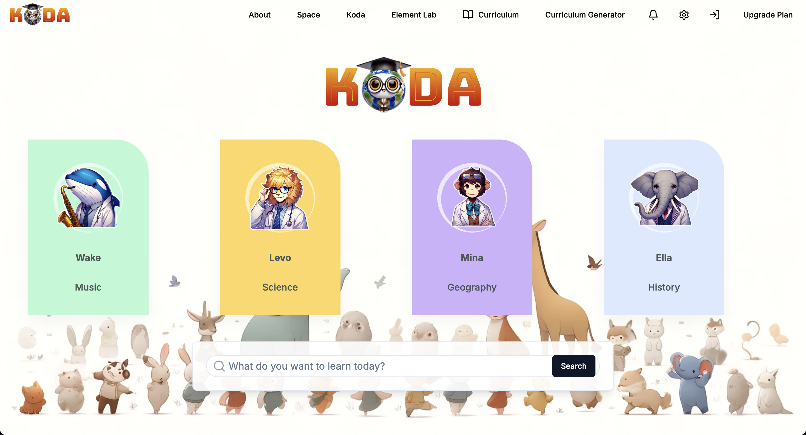

# Koda World



## Overview

# Table of Contents

1. [Koda World](#koda-world)
2. [Overview](#overview)
3. [Technology Stack](#technology-stack)
4. [Project Structure](#project-structure)
    - [Backend](#backend)
        - [ai71/main.py](#ai71mainpy)
        - [dialogue_management/manager.py](#dialogue_managementmanagerpy)
        - [database.py](#databasepy)
        - [curriculum_optimization/optimizer.py](#curriculum_optimizationoptimizerpy)
    - [API Integration](#api-integration)
        - [chat.ts](#chatts)
        - [apiutils.ts](#apiutilsts)
5. [Prompt Engineering](#prompt-engineering)
6. [SpacePage and ElementLab](#spacepage-and-elementlab)
7. [Optimizer.py Structure](#optimizerpy-structure)
8. [Characters and Activities](#characters-and-activities)
9. [Contact](#contact)
10. [Future Developments](#future-developments)
11. [Setup Instructions](#setup-instructions)
12. [Key Component: AI API Interface](#key-component-ai-api-interface)
    - [ai71/ai71_api.py](#ai71ai71_apipy)
13. [Key Component: Dialogue Management](#key-component-dialogue-management)
    - [ai71/dialogue_management/manager.py](#ai71dialogue_managementmanagerpy-1)

Imagine a world where education isn't just engaging, it's an adventure. That's KodaWorld - a revolutionary AI-powered learning platform that transforms studying into an exciting journey guided by charming animal companions.

Meet the cast of lovable characters:

- **Wake the musical whale**: A guide through the world of music and sound.
- **Levo the scholarly lion**: Ready to unravel the mysteries of science, math, and programming.
- **Mina the globetrotting monkey**: A partner in exploring geography, cultures, and even space.
- **Ella the wise elephant**: Here to make history come alive.
- **Koda the academic**: Represents a friend and mentor in various educational pursuits, emphasizing the spirit of learning and knowledge sharing.

With KodaWorld, students don't just memorize facts - they embark on interactive quests, solve puzzles, and engage in hands-on experiments. The cutting-edge AI adapts to each learner's pace and style, ensuring a personalized experience that's both challenging and fun.

## Technology Stack

- **Frontend**: Next.js, React, TypeScript
- **3D Rendering**: Three.js, React Three Fiber
- **State Management**: Zustand
- **Styling**: Tailwind CSS
- **Animations**: Framer Motion, GSAP
- **Backend**: Python, FastAPI
- **AI**: Falcon 180b, Falcon 11b, Langchain
- **Database**: PostgreSQL
- **Cache**: Redis

## Project Structure

The project is organized into two main parts:

1. **Frontend** (Next.js application in `src/` directory)
2. **Backend** (Python FastAPI application in `ai71/` directory)

### Backend

The key backend components are:

- **ai71/main.py**: The main entry point of the backend application. The API is set up using FastAPI and the server is run with Uvicorn (`uvicorn ai71.main:app --reload`).
- **dialogue_management/manager.py**: Manages dialogue with the AI characters.
- **database.py**: Manages database connections and migrations. Uses SQLAlchemy and Alembic.
- **curriculum_optimization/optimizer.py**: Optimizes the curriculum based on performance data and learning goals.

### API Integration

- **chat.ts**: Handles API calls related to chat functionalities.
- **apiutils.ts**: Contains utility functions for API integration.

### Prompt Engineering

Effective prompt engineering is crucial for the AI's performance. Key strategies include:

- **Detailed Prompts**: Clear and detailed prompts guide the AI in generating relevant and accurate responses.
- **System Messages**: Setting the context and expectations for each interaction.
- **Contextual User Input**: Including context from past interactions to maintain conversation continuity and relevance.
- **Character Personas**: Each character in KodaWorld has a distinct personality, knowledge base, and catchphrases to make interactions engaging and educational.

### SpacePage and ElementLab

- **SpacePage**: The interactive space where students engage with the AI characters and complete activities.
- **ElementLab**: Contains elements and customization options for creating interactive and engaging educational content.

### Optimizer.py Structure

- The optimizer processes current curriculums, performance data, and learning goals to generate optimized learning paths.
- It saves the optimized curriculum and associated data into the database for future reference and continuous improvement.

### Characters and Activities

- **Wake**: Guides students through a music visualizer and interactive music theory lessons.
- **Levo**: Engages students with a particle viewer, shapes games, numbers 2048 game, and problem-solving tasks.
- **Mina**: Leads explorations in geography and space through interactive maps and quizzes.
- **Ella**: Brings history to life with timelines, significant events, and historical figure highlights.
- **Koda**: Assists in academic pursuits across various subjects, embodying the role of a knowledgeable friend.

## Contact

For any queries, please contact at [kodaworld.edu@gmail.com](mailto:kodaworld.edu@gmail.com).

## Future Developments

### Peer Matching

**Current Status:**
Forms study groups based on skill levels and compatibility but lacks real-time adjustments and scalability.

**Enhancements:**
- **Heuristics-Based Matching:** Use logic-based algorithms for dynamic, real-time group formation, ensuring efficient and adaptive groupings.
- **Advanced Compatibility Metrics:** Integrate detailed metrics, including past collaboration success and real-time performance data, to enhance group compatibility.

### Gamification

**Current Status:**
Enhances engagement through achievements and challenges but lacks personalization and long-term strategies.

**Enhancements:**
- **Rule-Based Systems:** Implement predefined rules for adaptive challenges and achievements. This approach personalizes the learning experience based on student progress.
- **Varied Engagement Strategies:** Introduce diverse gamification elements like daily quests, streak rewards, and social achievements, using logic-based rules to maintain long-term engagement.

### Academic Curriculum Optimizer

**Current Status:**
Personalizes learning paths but needs better data integration and recommendation accuracy.

**Enhancements:**
- **Data Management Techniques:** Use advanced data management for better integration and analysis, ensuring precise and actionable learning path recommendations. Logic-based methods can effectively manage and interpret diverse performance metrics.
- **Feedback Loops:** Implement continuous improvement cycles using user feedback to refine recommendations, enhancing personalization.

### Academica

**Current Status:**
Generates interactive environments but struggles with relevance and engagement.

**Enhancements:**

- **Heuristic Content Generation:** Use heuristic rules to create consistent and engaging educational content. This method ensures relevance and engagement.
- **Enhanced Interaction Handling:** Improve processing and responses to student interactions using predefined logic, making interactions more meaningful and responsive.

### Expanding Game and Educational Tools

KodaWorld plans to introduce more game-based and educational tools accessible to all users. These tools will include interactive simulations, collaborative projects, and multimedia resources. By leveraging both educational theory and game design principles, these additions will make learning more immersive and enjoyable. The goal is to cater to diverse learning styles and interests, ensuring every student finds engaging and effective learning opportunities.

## Setup Instructions

1. Clone the repository.
2. Navigate to the project directory.
3. Install the required dependencies:

   ```bash
   pip install -r requirements.txt
   ```

4. Run the FastAPI server:

   ```bash
   uvicorn ai71.main:app --reload
   ```

## Key Component: AI API Interface

#### `ai71/ai71_api.py`

Interfaces with the AI API for various functionalities, including chat completions and memory management.

```python
# ai71/ai71_api.py

import os
import aiohttp
import logging
import json
from typing import List, Dict, Any, Optional, Union
from langchain.memory import ConversationBufferMemory
from langchain.schema import HumanMessage, SystemMessage, AIMessage

logging.basicConfig(level=logging.INFO, format='%(asctime)s - %(levelname)s - %(message)s')
logger = logging.getLogger(__name__)

class AI71API:
    def __init__(self, api_key: Optional[str] = None, base_url: str = "https://api.ai71.ai/v1"):
        self.api_key = api_key or os.getenv('AI71_API_KEY')
        if not self.api_key:
            raise ValueError("AI71_API_KEY not found. Please set it as an environment variable.")
        
        self.base_url = base_url
        self.headers = {
            "Authorization": f"Bearer {self.api_key}",
            "Content-Type": "application/json"
        }
        self.memory = ConversationBufferMemory(return_messages=True)

    async def _make_request(self, endpoint: str, payload: Dict[str, Any], stream: bool = False, max_retries: int = 3) -> Union[Dict[str, Any], aiohttp.ClientResponse]:
        url = f"{self.base_url}/{endpoint}"
        for attempt in range(max_retries):
            try:
                async with aiohttp.ClientSession(headers=self.headers) as session:
                    async with session.post(url, json=payload) as response:
                        response.raise_for_status()
                        if stream:
                            return response
                        else:
                            return await response.json()
            except aiohttp.ClientError as e:
                logger.error(f"Attempt {attempt + 1} failed: {str(e)}")
                if attempt == max_retries - 1:
                    raise
                await asyncio.sleep(2 ** attempt)  # Exponential backoff

    async def chat_completion(self, messages: List[Dict[str, str]], model: str = "falcon-11b", **kwargs) -> Dict[str, Any]:
        payload = {
            "model": model,
            "messages": messages,
            **kwargs
        }
        response = await self._make_request("chat/completions", payload)
        await self._update_memory(messages, response['choices'][0]['message']['content'])
        return response

    async def _update_memory(self, messages: List[Dict[str, str]], response: str):
        for message in messages:
            if message['role'] == 'user':
                self.memory.chat_memory.add_user_message(message['content'])
            elif message['role'] == 'system':
                self.memory.chat_memory.add_message(SystemMessage(content=message['content']))
        self.memory.chat_memory.add_ai_message(response)

    def get_conversation_history(self) -> List[Union[HumanMessage, AIMessage, SystemMessage]]:
        return self.memory.chat_memory.messages

    async def clear_memory(self):
        self.memory.clear()

    async def generate_with_memory(self, user_input: str, model: str = "falcon-180b", messages: List[Dict[str, str]] = None, **kwargs) -> str:
        if messages is None:
            messages = self.get_conversation_history()
            messages.append(HumanMessage(content=user_input))
            messages = [{"role": m.type, "content": m.content} for m in messages]
        else:
            messages.append({"role": "user", "content": user_input})
        
        response = await self.chat_completion(messages, model=model, **kwargs)
        return response['choices'][0]['message']['content']
```

This section of the code handles interactions with the AI API, managing chat completions, and maintaining conversation history through a memory buffer. The class `AI71API` includes methods for making requests to the API, processing chat completions, updating memory, and retrieving conversation history.

## Key Component: Dialogue Management

#### `ai71/dialogue_management/manager.py`

The `DialogueManager` class manages conversations between students and AI characters. It handles logging, character personas, generating character responses, and tracking conversation history.

### Key Features

1. **Character Personas**:
    - Wake (the Witty): Music expert with catchphrases like "Let's dive into the ocean of music!"
    - Levo (the Curious): Science and math expert with catchphrases like "Let's experiment with that idea!"
    - Mina (the Traveler): Geography and culture expert with catchphrases like "Let's embark on a new adventure!"
    - Ella (the Nostalgic): History expert with catchphrases like "History has much to teach us!"
    - Koda (the AI Tutor): General knowledge with catchphrases like "Learning is an adventure!"

2. **Logging Setup**:
    - Initializes a logger to track events and errors.

3. **Conversation Management**:
    - Tracks conversations for each student and character.
    - Generates character responses with a chance to include a catchphrase.
    - Processes and records AI responses and user input.

4. **Feedback and Progress Analysis**:
    - Collects and logs feedback from students.
    - Analyzes learning progress based on conversation history.
    - Recommends next steps based on analyzed progress.

### Code Summary

```python
import logging
from typing import List, Dict, Any
from datetime import datetime
import random

class DialogueManager:
    def __init__(self):
        self.logger = self._setup_logger()
        self.conversations: Dict[str, Dict[str, List[Dict[str, str]]]] = {}
        self.character_personas = {
            "wake": {"name": "Wake", "description": "the Witty", "traits": ["enthusiastic", "knowledgeable about music", "encouraging"], "topics": ["music theory", "instruments", "composers", "musical history"], "catchphrases": ["Let's dive into the ocean of music!", "That sounds harmonious!"]},
            "levo": {"name": "Levo", "description": "the Curious", "traits": ["analytical", "patient", "curious"], "topics": ["science", "math", "programming", "problem-solving"], "catchphrases": ["Let's experiment with that idea!", "Fascinating hypothesis!"]},
            "mina": {"name": "Mina", "description": "the Traveler", "traits": ["adventurous", "curious", "friendly"], "topics": ["geography", "cultures", "space", "travel"], "catchphrases": ["Let's embark on a new adventure!", "The world is full of wonders!"]},
            "ella": {"name": "Ella", "description": "the Nostalgic", "traits": ["wise", "thoughtful", "insightful"], "topics": ["history", "historical figures", "historical impact"], "catchphrases": ["History has much to teach us!", "Let's journey through time!"]},
            "ai-tutor": {"name": "Koda", "description": "the AI Tutor", "traits": ["adaptable", "encouraging", "patient"], "topics": ["various subjects", "learning strategies", "study skills"], "catchphrases": ["Learning is an adventure!", "Every question is a step towards knowledge!"]}
        }

    def _setup_logger(self):
        logger = logging.getLogger(__name__)
        logger.setLevel(logging.INFO)
        handler = logging.StreamHandler()
        formatter = logging.Formatter('%(asctime)s - %(name)s - %(levelname)s - %(message)s')
        handler.setFormatter(formatter)
        logger.addHandler(handler)
        return logger
    
    def _generate_character_response(self, character: str, content: str) -> str:
        persona = self.character_personas.get(character, self.character_personas["ai-tutor"])
        response = f"{content}"
        if random.random() < 0.1:  # 10% chance to add a catchphrase
            response += f" {random.choice(persona['catchphrases'])}"
        return response

    async def process_ai_response(self, response: str, student_id: str, character: str):
        character_response = self._generate_character_response(character, response)
        self.conversations.setdefault(student_id, {}).setdefault(character, []).append({"role": "assistant", "content": character_response, "timestamp": datetime.now().isoformat(), "character": character})
        return character_response

    async def get_conversation_history(self, student_id: str, character: str) -> List[Dict[str, str]]:
        history = self.conversations.get(student_id, {}).get(character, [])
        self.logger.info(f"Retrieved conversation history for student {student_id} with character {character}")
        return history

    async def clear_history(self, student_id: str, character: str):
        if student_id in self.conversations and character in self.conversations[student_id]:
            self.conversations[student_id][character] = []
        self.logger.info(f"Cleared conversation history for student {student_id} with character {character}")

    async def collect_feedback(self, student_id: str, feedback: str):
        self.logger.info(f"Collected feedback from student {student_id}: {feedback}")
        for character in self.conversations.get(student_id, {}):
            self.conversations[student_id][character].append({"role": "feedback", "content": feedback, "timestamp": datetime.now().isoformat()})

    async def analyze_learning_progress(self, student_id: str) -> Dict[str, Any]:
        all_interactions = [msg for character_history in self.conversations.get(student_id, {}).values() for msg in character_history]
        interaction_count = len(all_interactions)
        topic_coverage = len(set(msg["character"] for msg in all_interactions if msg["role"] == "assistant"))
        progress = min((interaction_count / 50) * 0.5 + (topic_coverage / len(self.character_personas)) * 0.5, 1.0)
        self.logger.info(f"Analyzed learning progress for student {student_id}")
        return {"progress": progress, "interaction_count": interaction_count, "topic_coverage": topic_coverage}

    async def recommend_next_steps(self, student_id: str) -> List[str]:
        progress_data = await self.analyze_learning_progress(student_id)
        progress = progress_data["progress"]
        if progress < 0.3:
            recommendations = ["Continue exploring topics with different KodaWorld characters", "Try out some of the interactive games and activities", "Don't hesitate to ask questions about topics you find interesting"]
        elif progress < 0.7:
            recommendations = ["Dive deeper into topics you've shown interest in", "Challenge yourself with more advanced questions", "Try to make connections between different subjects you've learned about"]
        else:
            recommendations = ["Explore advanced topics in your favorite subjects", "Try teaching what you've learned to others", "Work on a project that combines multiple areas of knowledge"]
        self.logger.info(f"Generated recommendations for student {student_id}")
        return recommendations

    async def optimize_curriculum(self, current_curriculum: Dict, performance_data: Dict, learning_goals: List[str]) -> Dict:
        self.logger.info(f"Optimizing curriculum")
        optimized_curriculum = current_curriculum.copy()
        avg_performance = sum(performance_data.values()) / len(performance_data) if performance_data else 0
        if avg_performance < 0.3:
            optimized_curriculum["difficulty"] = "beginner"
        elif avg_performance < 0.7:
            optimized_curriculum["difficulty"] = "intermediate"
        else:
            optimized_curriculum["difficulty"] = "advanced"
        optimized_curriculum["topics"] = list(set(current_curriculum.get("topics", []) + learning_goals))
        return {"optimized_curriculum": optimized_curriculum, "performance_data": performance_data, "learning_goals": learning_goals}
```

### Summary

- **Logging**: Setup and usage for debugging and tracking.
- **Character Personas**: Predefined traits and responses for each character.
- **Response Generation**: Creating character-specific responses.
- **Conversation Management**: Storing and retrieving conversation history.
- **Feedback Collection**: Logging feedback from students.
- **Progress Analysis**: Evaluating student interaction and progress.
- **Curriculum Optimization**: Adjusting curriculum based on performance data.
